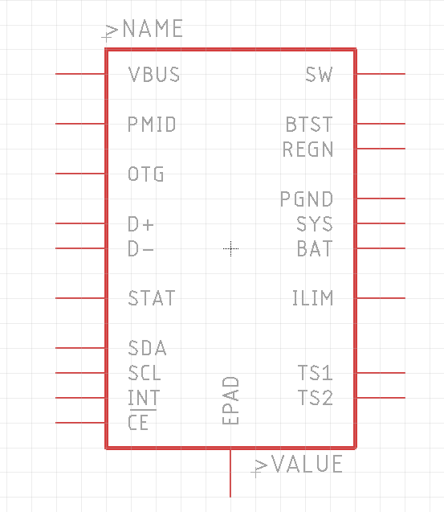
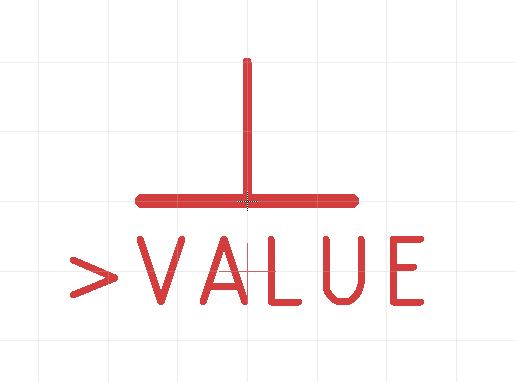

# Libraries

## Structure

## Descriptions

## Attributes

## Designators
* U: Integrated circuits, Modules, SoCs
* Q: Transistors, MOSFETs
* D: Diodes
* LED: LEDs
* X: Connectors that can be accessed from the outside (USB, XLR, Jacks,...)
* J: Internal connectors, like pin headers or debugging connectos

## Symbols

### Outlines
* Width 0.016
* 94 Symbols Layer
* Origin = Center of outline box

### Labeling
* NAMEs and VALUEs are size 0.07", ratio 8%, alinged bottom-left
* NAMEs are one half grid above the outline box
* Values are one grid below the outline box

 

## Footprints

### Labeling
* NAMEs and VALUEs are size 1mm, ratio 10%, alinged center

# Special Parts

## Supply Symbols

* VALUE in Symbols Layer centered below or above Symbols
* 0.05 size, 10% ratio

 